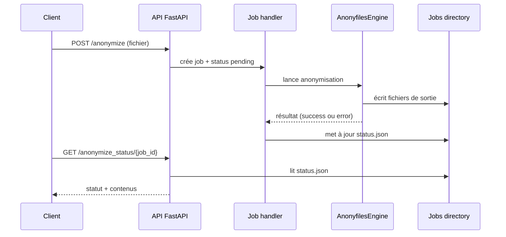
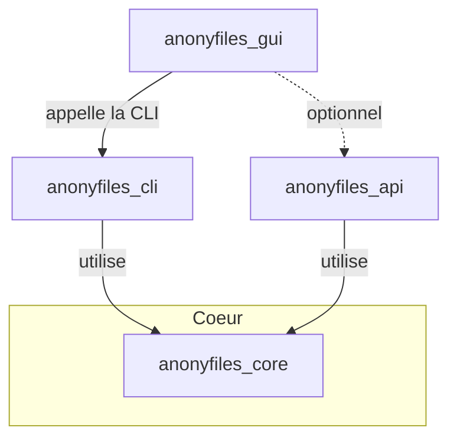

# 🕵️‍♂️ Anonyfiles

**Anonyfiles** est une solution open source complète pour l’anonymisation automatisée de documents texte, tableurs et fichiers bureautiques.
Elle s’appuie sur des technologies de traitement du langage naturel (spaCy) et des stratégies avancées de remplacement (Faker, codes, placeholders, etc.).

## 🌟 Pourquoi ce projet ?

À force d’utiliser l’intelligence artificielle dans des cas variés, un besoin simple mais essentiel s’est imposé :
👉 **pouvoir anonymiser rapidement des données textuelles avant de les soumettre à un traitement externe** (IA, workflow, audit, etc.).

Mais l’objectif ne s’arrêtait pas là :
🔁 **Pouvoir désanonymiser un fichier traité** grâce à un mapping généré pendant l’anonymisation faisait aussi partie des ambitions du projet.

Et comme je suis curieux et passionné, je me suis dit : autant en profiter pour aller plus loin
🧠 **en créant une solution complète, modulaire et réutilisable**, avec API, CLI et interface graphique moderne.

---

## 🧩 Trois couches principales

* **`anonyfiles_core`** : bibliothèque Python contenant tout le moteur d’anonymisation et de désanonymisation.
* **`anonyfiles_cli`** : outil en ligne de commande s’appuyant sur `anonyfiles_core` pour traiter les fichiers localement.
* **`anonyfiles_api`** : API REST (FastAPI) qui utilise également `anonyfiles_core` afin d’exposer les mêmes fonctionnalités à distance.

La GUI Tauri, située dans `anonyfiles_gui`, s’appuie elle-même sur l’API pour offrir une interface graphique.

## 🚀 Fonctionnalités principales

* Anonymisation de fichiers : `.txt`, `.csv`, `.docx`, `.xlsx`, `.pdf`, `.json`
* Détection automatique de noms, lieux, organisations, dates, emails, etc.
* Stratégies configurables : remplacement factice, `[REDACTED]`, codes séquentiels, etc.
* Mapping complet pour désanonymisation ou audit
* Export CSV des entités détectées
* Sélection fine des entités à anonymiser (interface graphique ou CLI)
* Prise en charge du français (et autres langues via spaCy)
* **Asynchrone via l’API REST** (suivi via `job_id`)
* **Portable** : aucun chemin codé en dur, multiplateforme (Windows, macOS, Linux)
* **Validation rapide** : les chemins, la configuration et la présence du modèle spaCy sont vérifiés avant de lancer le traitement

---

## ️ Structure du projet

```plaintext
anonyfiles/
ꜜ
├── README.md                  # Présent fichier
├── anonyfiles_core/           # Bibliothèque cœur
│   └── README.md              # Documentation du moteur
├── anonyfiles_cli/            # Outil CLI (Python)
│   └── README.md              # Documentation CLI détaillée
├── anonyfiles_api/            # API FastAPI pour appel distant
│   └── README.md              # Documentation API détaillée
├── anonyfiles_gui/            # Interface graphique (Tauri / Svelte)
│   └── README.md              # Documentation GUI détaillée
└── ...
```

# Architecture et flux de requête

Ce document décrit le chemin complet d'une requête depuis le client jusqu'au stockage des résultats ainsi que les relations entre la CLI, l'API et la GUI.

## Modules principaux

- **anonyfiles_core** : moteur d'anonymisation commun.
- **anonyfiles_cli** : outil en ligne de commande utilisant `anonyfiles_core`.
- **anonyfiles_api** : API FastAPI qui réutilise également `anonyfiles_core`.
- **anonyfiles_gui** : interface graphique Tauri qui s'appuie sur la CLI.

Extrait du `README.md` montrant cette organisation :

```text
* `anonyfiles_cli` : outil en ligne de commande s’appuyant sur `anonyfiles_core` pour traiter les fichiers localement.
* `anonyfiles_api` : API REST (FastAPI) qui utilise également `anonyfiles_core` afin d’exposer les mêmes fonctionnalités à distance.
La GUI Tauri, située dans `anonyfiles_gui`, s’appuie elle-même sur l’API pour offrir une interface graphique.
```

## Flux complet d'une requête d'anonymisation

1. **Client** : envoie une requête `POST /anonymize` avec le fichier et les options.
2. **API FastAPI** : sauvegarde le fichier dans un dossier de job (`jobs/<job_id>`), écrit `status.json` et lance `run_anonymization_job_sync` en tâche de fond.
3. **Moteur `AnonyfilesEngine`** : lit le fichier, applique les règles d'anonymisation, écrit les fichiers de sortie (texte anonymisé, mapping CSV, log CSV, audit).
4. **Job utils** : met à jour `status.json` à `finished` ou `error` et stocke le journal d'audit.
5. **Client** : récupère le statut via `GET /anonymize_status/{job_id}` ou la WebSocket `/ws/{job_id}` puis télécharge éventuellement les fichiers avec `GET /files/{job_id}/{file_key}`.

Les fichiers générés sont stockés dans le dossier `jobs/` (aucune base de données n'est utilisée par défaut).



## Relations CLI, API et GUI



La CLI et l’API partagent le même moteur (`anonyfiles_core`). La GUI interagit principalement avec la CLI pour réaliser l’anonymisation localement mais peut aussi appeler l’API si un serveur distant est disponible.


### Utilisation commune du cœur

La CLI et l’API invoquent toutes deux le même moteur situé dans `anonyfiles_core`.
Par exemple, la CLI démarre ainsi :

```python
from anonyfiles_core import AnonyfilesEngine

engine = AnonyfilesEngine(config_path)
engine.anonymize_file("input.txt")
```

De son côté, l’API réutilise exactement cette classe pour traiter les requêtes :

```python
from anonyfiles_core import AnonyfilesEngine

@router.post("/anonymize")
async def anonymize(file: UploadFile):
    engine = AnonyfilesEngine(config_path)
    # temporary async wrapper around `anonymize`

    return await engine.anonymize_async(file)
```
Cet appel asynchrone utilise simplement ``asyncio.to_thread`` pour exécuter la
méthode de base de façon non bloquante.


---

## 🛆 Installation rapide

### Pré-requis

* Python 3.11 (recommandé, testé en production)
* Node.js 18+, npm/yarn (pour la GUI)
* Rust & Cargo (pour la GUI)
* Modèle spaCy `fr_core_news_md`

### 🐳 Installation Zéro-Config (Docker)

La méthode la plus simple pour tester l'API sans rien installer sur votre machine (à part Docker).

```bash
# Construire l'image
docker build -t anonyfiles .

# Lancer le conteneur sur le port 8000
docker run -p 8000:8000 anonyfiles
```
L'API sera alors accessible sur [http://localhost:8000/docs](http://localhost:8000/docs).

### Clonage du projet

Si vous souhaitez contribuer ou utiliser la CLI localement :

```bash
git clone https://github.com/simongrossi/anonyfiles.git
cd anonyfiles
```

Chaque dossier possède son propre `requirements.txt`, mais il est recommandé d'utiliser le fichier racine.

**Pour les utilisateurs (installation standard) :**
Utilise le `pyproject.toml` pour résoudre les dépendances compatibles.
```bash
pip install -e .
```

**Pour les développeurs (environnement figé) :**
Utilise `requirements.txt` pour garantir des versions identiques à la CI.
```bash
pip install -r requirements.txt
```

> **Note importante :** Le fichier `requirements.txt` à la racine est la référence synchronisée. Évitez d'utiliser les anciens fichiers `requirements.txt` présents dans les sous-dossiers (`anonyfiles_cli/`, etc.) qui sont conservés uniquement pour compatibilité historique.


### Installation CLI

➡️ Voir [`anonyfiles_cli/README.md`](anonyfiles_cli/README.md)

Pour activer l'autocomplétion Bash, Zsh ou Fish :

```bash
anonyfiles_cli --install-completion bash   # ou zsh/fish
```


### Installation GUI

➡️ Voir [`anonyfiles_gui/README.md`](anonyfiles_gui/README.md)

* Interface graphique moderne (Svelte + Rust via Tauri)
* Drag & drop, sélection intuitive des entités à anonymiser
* Mode sombre, responsive, traitement local sécurisé
* Copie et prévisualisation des résultats


### Lancement de l’API

➡️ Voir [`anonyfiles_api/README.md`](anonyfiles_api/README.md)

---

## ⚙️ Setup automatique des environnements

Afin d’isoler proprement les dépendances entre la CLI, l’API et la GUI, le projet utilise trois environnements virtuels distincts :

* `env-cli` → pour `anonyfiles_cli` *(spaCy, typer…)*
* `env-api` → pour `anonyfiles_api` *(FastAPI, pydantic…)*
* `env-gui` → pour les éventuelles dépendances Python liées à la GUI

Des scripts de configuration automatique sont disponibles à la racine du projet pour **Linux/macOS** et **Windows** :

---

### ▶️ Linux / macOS (avec Makefile)

Pour simplifier l'installation et l'exécution sous Linux et macOS, utilisez le `Makefile` fourni à la racine du projet.

#### ✨ Installation initiale

**Utilisateurs Debian/Ubuntu uniquement :**
Si vous n'avez pas Python 3.11, pip, venv ou Node.js installés, vous pouvez utiliser :
```bash
make install-deps-debian  # Requiert sudo
```

**Pour tous les utilisateurs (Linux/macOS) :**
Créez les environnements virtuels et installez les dépendances Python/Node locales avec :
```bash
make setup
```

Cette commande va :

* Créer les environnements virtuels (`env-cli`, `env-api`, `env-gui`)
* Installer les dépendances Python standardisées (depuis `requirements.txt`)
* Installer les modules npm pour la GUI (si `npm` est disponible)
* Télécharger le modèle spaCy `fr_core_news_md` dans l'environnement `env-cli`

#### 🔢 Commandes courantes

```bash
make cli         # Lancer un exemple CLI
make api         # Lancer l'API FastAPI
make gui         # Construire les fichiers statiques de la GUI (build web)
make test-api    # Lancer un test API (avec curl)
make clean       # Nettoyer les environnements virtuels
```

---

### 🪟 Windows (PowerShell ou CMD)

Pour les utilisateurs Windows, utilisez les scripts **PowerShell** ou les fichiers **batch** :

#### PowerShell (recommandé)

```powershell
./anonyfiles.ps1 -action setup     # Crée les environnements et installe les dépendances
./anonyfiles.ps1 -action api       # Lance l’API FastAPI
./anonyfiles.ps1 -action cli       # Lance le moteur CLI
./anonyfiles.ps1 -action gui       # Lance la GUI (Tauri)
./anonyfiles.ps1 -action clean     # Supprime les environnements
```

#### CMD (invite de commande Windows classique)

```cmd
anonyfiles.bat setup    :: Crée les environnements et installe les dépendances
anonyfiles.bat api      :: Lance l’API
anonyfiles.bat cli      :: Lance le moteur CLI
anonyfiles.bat gui      :: Lance la GUI (Tauri)
anonyfiles.bat clean    :: Supprime les environnements
```

---

### 📁 Scripts disponibles

Les fichiers suivants sont disponibles à la racine du projet :

* `Makefile`
* `anonyfiles.ps1`

* `anonyfiles.bat`

## 📂 Fichier `default_paths.toml`

Les chemins de sortie par défaut peuvent être configurés dans le fichier
`default_paths.toml` à la racine du projet. Exemple :

```toml
[paths]
output_dir = "~/anonyfiles_outputs"
mapping_dir = "~/anonyfiles_mappings"
log_dir = "~/anonyfiles_logs"
```

> **⚠️ Note pour les utilisateurs Windows :**
> L'utilisation du tilde `~` (raccourci pour le dossier utilisateur) est prise en charge par le code Python, mais peut parfois prêter à confusion selon votre configuration.
> Si les fichiers ne sont pas créés à l'endroit attendu (ex : `C:\Users\VotreNom`), **modifiez ce fichier** pour utiliser des chemins absolus (ex : `C:/Projets/anonyfiles/sorties` ou `C:\\Values\\...`).
> *Note : Les variables d'environnement comme `ANONYFILES_OUTPUT_DIR` ne sont pas supportées directement pour surcharger ces valeurs isolément ; éditez le fichier TOML ou utilisez l'option CLI `--output-dir`.*


Ces valeurs seront chargées automatiquement par la CLI et la GUI pour
déterminer où écrire les fichiers générés. Vous pouvez également
fournir un autre fichier en définissant la variable d’environnement
`ANONYFILES_DEFAULTS_FILE` qui pointera vers un fichier `default_paths.toml`
personnalisé. Exemple d’activation :

```bash
# Dans un shell
export ANONYFILES_DEFAULTS_FILE=/etc/anonyfiles/paths.toml
```

Ou dans un service Systemd :

```ini
[Service]
Environment=ANONYFILES_DEFAULTS_FILE=/etc/anonyfiles/paths.toml
```

## 📝 Format des logs CLI

Chaque entrée du fichier `cli_audit_log.jsonl` est une ligne JSON.
En plus des champs existants (`timestamp`, `success`, `error`, etc.),
les erreurs enregistrent désormais le `command` exécuté et les `arguments`
passés à la CLI lorsque ces informations sont disponibles.

## 📖 Documentation détaillée

* **Core :** Voir [`anonyfiles_core/README.md`](anonyfiles_core/README.md)
* **CLI :** Voir [`anonyfiles_cli/README.md`](anonyfiles_cli/README.md)
* **GUI :** Voir [`anonyfiles_gui/README.md`](anonyfiles_gui/README.md)
* **API :** Voir [`anonyfiles_api/README.md`](anonyfiles_api/README.md)

---

## 🚣️ Roadmap

| Priorité | Thème                                            | État          | Commentaire / Lien tâche                 |
| -------- | ------------------------------------------------ | ------------- | ---------------------------------------- |
| 1        | Robustesse multi-format (TXT, CSV, DOCX, XLSX)   | ✅ Fait        | Moteur factorisé, détection commune      |
| 2        | Remplacement positionnel fiable                  | ✅ Fait        | Validé pour PDF et DOCX (conservation format) |
| 3        | Détection universelle des dates et emails        | ✅ Fait        | Regex avancée + spaCy                    |
| 4        | Performance / gestion mémoire                    | 🔜 À venir    | Streaming, lazy processing               |
| 5        | Règles de remplacement par type (YAML)           | ✅ Fait        | Custom rules implémentées et testées     |
| 6        | Mapping codes <-> originaux                      | ✅ Fait        | Mapping inverse et audit fonctionnels    |
| 7        | Filtre exclusion (YAML / CLI)                    | ✅ Fait        | Configurable, évite faux positifs        |
| 8        | Support PDF / JSON                               | ✅ Fait        | PDF natif (fitz), JSON complet           |
| 9        | Désanonymisation CLI (mapping inverse)           | ✅ Fait        | Commande `deanonymize` opérationnelle    |
| 10       | GUI avancée (drag & drop, prévisualisation)      | 🚧 En cours   | Tauri/Svelte, UX moderne                 |
| 11       | Copie, export, gestion multi-fichier dans la GUI | 🚧 En cours   | Copier/coller, sélection, batch          |
| 12       | Support anglais, espagnol, allemand              | 🔜 À venir    | Modèles spaCy additionnels               |
| 13       | API asynchrone avec suivi de jobs (`job_id`)     | ✅ Fait        | CORS, UUID, audit log complet            |

---

## 📦 Déploiement de l'API

Un guide détaillé (Docker, systemd, Nixpacks) est disponible dans
[`deploy/README.md`](deploy/README.md).

Le fichier `deploy/anonyfiles-api.service` permet de lancer l'API comme service
systemd. Les réglages principaux s'appuient sur des variables d'environnement à
définir (par exemple dans `/etc/default/anonyfiles-api`) :

- `ANONYFILES_USER` : utilisateur exécutant le service
- `ANONYFILES_HOME` : répertoire racine du projet
- `ANONYFILES_HOST` : adresse d'écoute d'uvicorn (ex. `127.0.0.1`)
- `ANONYFILES_PORT` : port d'écoute de l'API (ex. `8000`)
- `ANONYFILES_JOBS_DIR` : répertoire des jobs (défaut `jobs`)

Un fichier `railway.json.example` est fourni à la racine pour simplifier un
déploiement via Railway. Copiez-le en `railway.json` puis ajustez les valeurs
(nom du service, chemin de santé, variables d'environnement...) avant de
lancer votre déploiement.

---

## 🤝 Contribuer

* Toute contribution est la bienvenue : bugfix, traduction, documentation, suggestion !
* Avant de lancer les tests, installez les dépendances dédiées :

  ```bash
  pip install -r requirements-test.txt
  ```

* Les dépendances principales sont définies dans `requirements.in`. Utilisez
  [pip-tools](https://pypi.org/project/pip-tools/) pour générer un
  `requirements.txt` figé :

  ```bash
  pip install pip-tools
  pip-compile requirements.in
  pip-compile requirements-test.in  # fige aussi les dépendances de test
  ```

* Merci de créer une issue ou une PR avec un descriptif clair et un code lisible.

---

## 📄 Licence

Projet distribué sous licence MIT. Voir [LICENSE](LICENSE).

---

## 👨💻 Auteur & Liens

* Projet développé par [Simon Grossi](https://github.com/simongrossi)
* Repo GitHub principal : [https://github.com/simongrossi/anonyfiles](https://github.com/simongrossi/anonyfiles)

---

*Pour toute question, consultez la documentation CLI/GUI/API ou ouvrez une issue sur GitHub.*
