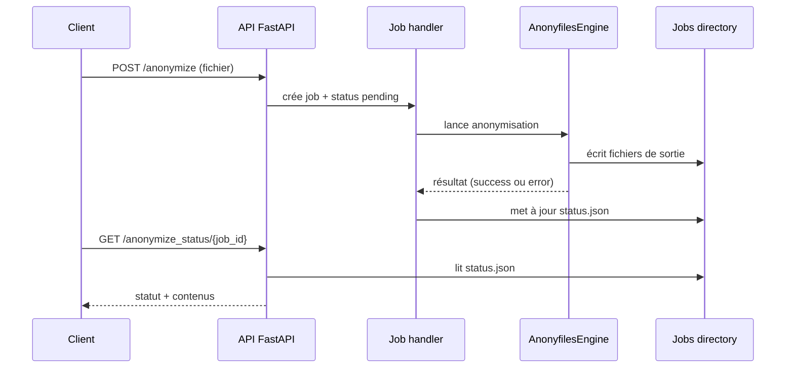
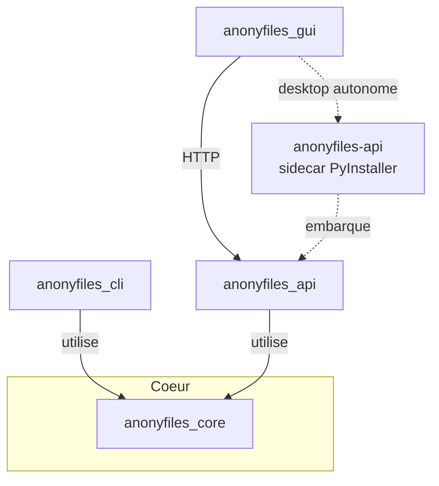

# 🕵️‍♂️ Anonyfiles

**Anonyfiles** est une solution open source complète pour l’anonymisation automatisée de documents texte, tableurs et fichiers bureautiques.
Elle s’appuie sur des technologies de traitement du langage naturel (spaCy) et des stratégies avancées de remplacement (Faker, codes, placeholders, etc.).

## 🌟 Pourquoi ce projet ?

À force d’utiliser l’intelligence artificielle dans des cas variés, un besoin simple mais essentiel s’est imposé :
👉 **pouvoir anonymiser rapidement des données textuelles avant de les soumettre à un traitement externe** (IA, workflow, audit, etc.).

Mais l’objectif ne s’arrêtait pas là :
🔁 **Pouvoir désanonymiser un fichier traité** grâce à un mapping généré pendant l’anonymisation faisait aussi partie des ambitions du projet.

Et comme je suis curieux et passionné, je me suis dit : autant en profiter pour aller plus loin
🧠 **en créant une solution complète, modulaire et réutilisable**, avec API, CLI et interface graphique moderne.

---

## 🧩 Trois couches principales

* **`anonyfiles_core`** : bibliothèque Python contenant tout le moteur d’anonymisation et de désanonymisation.
* **`anonyfiles_cli`** : outil en ligne de commande s’appuyant sur `anonyfiles_core` pour traiter les fichiers localement.
* **`anonyfiles_api`** : API REST (FastAPI) qui utilise également `anonyfiles_core` afin d’exposer les mêmes fonctionnalités à distance.

La GUI Tauri 2 (dans `anonyfiles_gui`) parle HTTP à l'API. En mode desktop autonome, elle embarque l'API comme **sidecar PyInstaller** et la spawne automatiquement au démarrage (rien à lancer à la main).

## 🚀 Fonctionnalités principales

* Anonymisation de fichiers : `.txt`, `.csv`, `.docx` (y compris dans les tableaux), `.xlsx` (multi-feuilles), `.pdf`, `.json`
* Détection automatique de noms, lieux, organisations, dates, emails, etc.
* Stratégies configurables : remplacement factice, `[REDACTED]`, codes séquentiels, etc.
* Mapping complet pour désanonymisation ou audit
* Export CSV des entités détectées
* Sélection fine des entités à anonymiser (interface graphique ou CLI)
* **Moteur Hybride Optimisé** : Combinaison puissante de Regex compilées nativement dans SpaCy (EntityRuler) et de validation contextuelle (e.g. validateur de dates).
* Prise en charge du français (et autres langues via spaCy)
* **Données réalistes** : Intégration de la librairie **Faker** pour générer des faux noms, adresses, etc. cohérents.
* **Asynchrone via l’API REST** (suivi via `job_id`)
* **Portable** : aucun chemin codé en dur, multiplateforme (Windows, macOS, Linux)
* **Validation rapide** : les chemins, la configuration et la présence du modèle spaCy sont vérifiés avant de lancer le traitement

---

## ️ Structure du projet

```plaintext
anonyfiles/
ꜜ
├── README.md                  # Présent fichier
├── anonyfiles_core/           # Bibliothèque cœur
│   └── README.md              # Documentation du moteur
├── anonyfiles_cli/            # Outil CLI (Python)
│   └── README.md              # Documentation CLI détaillée
├── anonyfiles_api/            # API FastAPI pour appel distant
│   └── README.md              # Documentation API détaillée
├── anonyfiles_gui/            # Interface graphique (Tauri / Svelte)
│   └── README.md              # Documentation GUI détaillée
└── ...
```

# Architecture et flux de requête

Ce document décrit le chemin complet d'une requête depuis le client jusqu'au stockage des résultats ainsi que les relations entre la CLI, l'API et la GUI.

## Modules principaux

- **anonyfiles_core** : moteur d'anonymisation commun.
- **anonyfiles_cli** : outil en ligne de commande utilisant `anonyfiles_core`.
- **anonyfiles_api** : API FastAPI qui réutilise également `anonyfiles_core`.
- **anonyfiles_gui** : interface graphique Tauri 2 qui parle HTTP à l'API. En mode desktop autonome, l'API est embarquée comme sidecar PyInstaller ; sur déploiement serveur (Docker, Railway), c'est un `uvicorn` classique.

## Flux complet d'une requête d'anonymisation

1. **Client** : envoie une requête `POST /anonymize` avec le fichier et les options.
2. **API FastAPI** : sauvegarde le fichier dans un dossier de job (`jobs/<job_id>`), écrit `status.json` et lance `run_anonymization_job_sync` en tâche de fond.
3. **Moteur `AnonyfilesEngine`** : lit le fichier, applique les règles d'anonymisation, écrit les fichiers de sortie (texte anonymisé, mapping CSV, log CSV, audit).
4. **Job utils** : met à jour `status.json` à `finished` ou `error` et stocke le journal d'audit.
5. **Client** : récupère le statut via `GET /anonymize_status/{job_id}` ou la WebSocket `/ws/{job_id}` puis télécharge éventuellement les fichiers avec `GET /files/{job_id}/{file_key}`.

Les fichiers générés sont stockés dans le dossier `jobs/` (aucune base de données n'est utilisée par défaut).


```mermaid
sequenceDiagram
    participant C as Client
    participant A as API FastAPI
    participant J as Job handler
    participant E as AnonyfilesEngine
    participant F as Jobs directory

    C->>A: POST /anonymize (fichier)
    A->>J: crée job + status pending
    J->>E: lance anonymisation
    E->>F: écrit fichiers de sortie
    E-->>J: résultat (success ou error)
    J->>F: met à jour status.json
    C->>A: GET /anonymize_status/{job_id}
    A->>F: lit status.json
    A-->>C: statut + contenus
```

## Relations CLI, API et GUI


```mermaid
graph TD
    subgraph Coeur
        CORE["anonyfiles_core"]
    end

    CLI["anonyfiles_cli"] -->|utilise| CORE
    API["anonyfiles_api"] -->|utilise| CORE
    GUI["anonyfiles_gui"] -->|HTTP| API
    SIDECAR["anonyfiles-api<br/>sidecar PyInstaller"] -.->|embarque| API
    GUI -.->|desktop autonome| SIDECAR
```

La CLI et l'API partagent le même moteur (`anonyfiles_core`). La GUI parle HTTP à l'API en toutes circonstances : en desktop autonome elle spawne le sidecar PyInstaller au démarrage, en mode web elle pointe vers l'API servie par Docker / nginx.


### Utilisation commune du cœur

La CLI et l’API invoquent toutes deux le même moteur situé dans `anonyfiles_core`.
Par exemple, la CLI démarre ainsi :

```python
from anonyfiles_core import AnonyfilesEngine

engine = AnonyfilesEngine(config_path)
engine.anonymize_file("input.txt")
```

De son côté, l’API réutilise exactement cette classe pour traiter les requêtes :

```python
from anonyfiles_core import AnonyfilesEngine

@router.post("/anonymize")
async def anonymize(file: UploadFile):
    engine = AnonyfilesEngine(config_path)
    # temporary async wrapper around `anonymize`

    return await engine.anonymize_async(file)
```
Cet appel asynchrone utilise simplement ``asyncio.to_thread`` pour exécuter la
méthode de base de façon non bloquante.


---

### ⚡ Démarrage Rapide (API avec Docker)

La méthode la plus simple pour tester l'API sans rien installer sur votre machine (ni Python, ni dépendances).

**Commande unique ("One-Liner") :**
```bash
docker build -t anonyfiles . && docker run -p 8000:8000 anonyfiles
```
Une fois lancé :
👉 Ouvrez **[http://localhost:8000/docs](http://localhost:8000/docs)** pour tester l'API via l'interface interactive Swagger.

### 🖥️ Application desktop autonome

Pour produire une app macOS / Windows / Linux qui contient tout (GUI + API + modèle spaCy), sans dépendance externe :

```bash
make desktop
```

Cela enchaîne :

1. `make env-pkg` — venv dédié avec `anonyfiles[packaging]` (PyInstaller) + modèle `fr_core_news_md`.
2. `python packaging/sidecar/build_sidecar.py` — PyInstaller produit `anonyfiles-api-<triple>` dans `anonyfiles_gui/src-tauri/binaries/`.
3. `cd anonyfiles_gui && npm install && npm run tauri build` — bundle Tauri qui embarque le sidecar.

Sorties dans `anonyfiles_gui/src-tauri/target/release/bundle/` : `.app` + `.dmg` (macOS), `.msi` + `.exe` (Windows), `.AppImage` + `.deb` (Linux). Taille ~400 Mo à cause du modèle spaCy.

La CI `desktop-build.yml` produit ces artifacts automatiquement sur tag `v*` pour les 4 cibles (macOS ARM, macOS Intel, Windows, Linux).

---

### 🛆 Installation Standard (Développeurs / CLI)

#### Pré-requis

* Python 3.11 (recommandé, testé en production)
* Node.js 18+, npm/yarn (pour la GUI)
* Rust & Cargo (pour la GUI)
* Modèle spaCy `fr_core_news_md`

#### Clonage du projet

Si vous souhaitez utiliser la CLI ou contribuer :

```bash
git clone https://github.com/simongrossi/anonyfiles.git
cd anonyfiles
```

Chaque dossier possède sa configuration, mais l'installation se fait à la racine via `pyproject.toml`.
 
**Pour les utilisateurs (installation standard) :**
```bash
pip install -e .
```
 
**Pour les développeurs (avec outils de test et qualité) :**
```bash
pip install -e .[dev]
```

### 📥 Étape post-installation : Modèle NLP

Après l'installation des paquets Python, vous **devez** télécharger le modèle de langue française pour spaCy :

```bash
python -m spacy download fr_core_news_md
```
*(Si cela échoue pour cause de permissions, essayez avec `sudo` ou vérifiez votre environnement virtuel.)*

### Installation CLI

➡️ Voir [`anonyfiles_cli/README.md`](anonyfiles_cli/README.md)

Pour activer l'autocomplétion Bash, Zsh ou Fish :

```bash
anonyfiles-cli --install-completion bash   # ou zsh/fish
```


### Installation GUI

➡️ Voir [`anonyfiles_gui/README.md`](anonyfiles_gui/README.md)

* Interface graphique moderne (Svelte + Rust via Tauri)
* Drag & drop, sélection intuitive des entités à anonymiser
* Mode sombre, responsive, traitement local sécurisé
* Copie et prévisualisation des résultats


### Lancement de l’API

➡️ Voir [`anonyfiles_api/README.md`](anonyfiles_api/README.md)

---

## ⚙️ Setup automatique des environnements

Afin d’isoler proprement les dépendances entre la CLI, l’API et la GUI, le projet utilise trois environnements virtuels distincts :

* `env-cli` → pour `anonyfiles_cli` *(spaCy, typer…)*
* `env-api` → pour `anonyfiles_api` *(FastAPI, pydantic…)*
* `env-gui` → pour les éventuelles dépendances Python liées à la GUI

Des scripts de configuration automatique sont disponibles à la racine du projet pour **Linux/macOS** et **Windows** :

---

### ▶️ Linux / macOS (avec Makefile)

Pour simplifier l'installation et l'exécution sous Linux et macOS, utilisez le `Makefile` fourni à la racine du projet.

#### ✨ Installation initiale

**Utilisateurs Debian/Ubuntu uniquement :**
Si vous n'avez pas Python 3.11, pip, venv ou Node.js installés, vous pouvez utiliser :
```bash
make install-deps-debian  # Requiert sudo
```

**Pour tous les utilisateurs (Linux/macOS) :**
Créez les environnements virtuels et installez les dépendances Python/Node locales avec :
```bash
make setup
```

Cette commande va :

* Créer les environnements virtuels (`env-cli`, `env-api`, `env-gui`)
* Installer les dépendances Python standardisées (depuis `pyproject.toml`)
* Installer les modules npm pour la GUI (si `npm` est disponible)
* Télécharger le modèle spaCy `fr_core_news_md` dans l'environnement `env-cli`

#### 🔢 Commandes courantes

```bash
make cli         # Lancer un exemple CLI
make api         # Lancer l'API FastAPI
make gui         # Construire les fichiers statiques de la GUI (build web)
make test-api    # Lancer un test API (avec curl)
make clean       # Nettoyer les environnements virtuels
```

---

### 🪟 Windows (PowerShell ou CMD)

Pour les utilisateurs Windows, utilisez les scripts **PowerShell** ou les fichiers **batch** :

#### PowerShell (recommandé)

```powershell
./anonyfiles.ps1 -action setup     # Crée les environnements et installe les dépendances
./anonyfiles.ps1 -action api       # Lance l’API FastAPI
./anonyfiles.ps1 -action cli       # Lance le moteur CLI
./anonyfiles.ps1 -action gui       # Lance la GUI (Tauri)
./anonyfiles.ps1 -action clean     # Supprime les environnements
```

#### CMD (invite de commande Windows classique)

```cmd
anonyfiles.bat setup    :: Crée les environnements et installe les dépendances
anonyfiles.bat api      :: Lance l’API
anonyfiles.bat cli      :: Lance le moteur CLI
anonyfiles.bat gui      :: Lance la GUI (Tauri)
anonyfiles.bat clean    :: Supprime les environnements
```

---

### 📁 Scripts disponibles

Les fichiers suivants sont disponibles à la racine du projet :

* `Makefile`
* `anonyfiles.ps1`

* `anonyfiles.bat`

## 📂 Fichier `default_paths.toml`

Les chemins de sortie par défaut peuvent être configurés dans le fichier
`default_paths.toml` à la racine du projet. Exemple :

```toml
[paths]
output_dir = "~/anonyfiles_outputs"
mapping_dir = "~/anonyfiles_mappings"
log_dir = "~/anonyfiles_logs"
```

> **⚠️ Note pour les utilisateurs Windows :**
> L'utilisation du tilde `~` (raccourci pour le dossier utilisateur) est prise en charge par le code Python, mais peut parfois prêter à confusion selon votre configuration.
> Si les fichiers ne sont pas créés à l'endroit attendu (ex : `C:\Users\VotreNom`), **modifiez ce fichier** pour utiliser des chemins absolus (ex : `C:/Projets/anonyfiles/sorties` ou `C:\\Values\\...`).
> *Note : Les variables d'environnement comme `ANONYFILES_OUTPUT_DIR` ne sont pas supportées directement pour surcharger ces valeurs isolément ; éditez le fichier TOML ou utilisez l'option CLI `--output-dir`.*


Ces valeurs seront chargées automatiquement par la CLI et la GUI pour
déterminer où écrire les fichiers générés. Vous pouvez également
fournir un autre fichier en définissant la variable d’environnement
`ANONYFILES_DEFAULTS_FILE` qui pointera vers un fichier `default_paths.toml`
personnalisé. Exemple d’activation :

```bash
# Dans un shell
export ANONYFILES_DEFAULTS_FILE=/etc/anonyfiles/paths.toml
```

Ou dans un service Systemd :

```ini
[Service]
Environment=ANONYFILES_DEFAULTS_FILE=/etc/anonyfiles/paths.toml
```

## 📝 Format des logs CLI

Chaque entrée du fichier `cli_audit_log.jsonl` est une ligne JSON.
En plus des champs existants (`timestamp`, `success`, `error`, etc.),
les erreurs enregistrent désormais le `command` exécuté et les `arguments`
passés à la CLI lorsque ces informations sont disponibles.

## 📖 Documentation détaillée

* **Core :** Voir [`anonyfiles_core/README.md`](anonyfiles_core/README.md)
* **CLI :** Voir [`anonyfiles_cli/README.md`](anonyfiles_cli/README.md)
* **GUI :** Voir [`anonyfiles_gui/README.md`](anonyfiles_gui/README.md)
* **API :** Voir [`anonyfiles_api/README.md`](anonyfiles_api/README.md)

---

## 🚣️ Roadmap

| Priorité | Thème                                            | État          | Commentaire / Lien tâche                 |
| -------- | ------------------------------------------------ | ------------- | ---------------------------------------- |
| 1        | Robustesse multi-format (TXT, CSV, DOCX, XLSX)   | ✅ Fait        | Moteur factorisé, détection commune      |
| 2        | Remplacement positionnel fiable                  | ✅ Fait        | Validé pour PDF et DOCX (conservation format) |
| 3        | Détection universelle des dates et emails        | ✅ Fait        | Regex avancée + spaCy                    |
| 4        | Performance / gestion mémoire                    | 🔜 À venir    | Streaming, lazy processing               |
| 5        | Règles de remplacement par type (YAML)           | ✅ Fait        | Custom rules implémentées et testées     |
| 6        | Mapping codes <-> originaux                      | ✅ Fait        | Mapping inverse et audit fonctionnels    |
| 7        | Filtre exclusion (YAML / CLI)                    | ✅ Fait        | Configurable, évite faux positifs        |
| 8        | Support PDF / JSON                               | ✅ Fait        | PDF natif (fitz), JSON complet           |
| 9        | Désanonymisation CLI (mapping inverse)           | ✅ Fait        | Commande `deanonymize` opérationnelle    |
| 10       | GUI avancée (drag & drop, prévisualisation)      | 🚧 En cours   | Tauri/Svelte, UX moderne                 |
| 11       | Copie, export, gestion multi-fichier dans la GUI | 🚧 En cours   | Copier/coller, sélection, batch          |
| 12       | Support anglais, espagnol, allemand              | 🔜 À venir    | Modèles spaCy additionnels               |
| 13       | API asynchrone avec suivi de jobs (`job_id`)     | ✅ Fait        | CORS, UUID, audit log complet            |

---

## 📦 Déploiement de l'API

Un guide détaillé (Docker, systemd, Nixpacks) est disponible dans
[`deploy/README.md`](deploy/README.md).

Le fichier `deploy/anonyfiles-api.service` permet de lancer l'API comme service
systemd. Les réglages principaux s'appuient sur des variables d'environnement à
définir (par exemple dans `/etc/default/anonyfiles-api`) :

- `ANONYFILES_USER` : utilisateur exécutant le service
- `ANONYFILES_HOME` : répertoire racine du projet
- `ANONYFILES_HOST` : adresse d'écoute d'uvicorn (ex. `127.0.0.1`)
- `ANONYFILES_PORT` : port d'écoute de l'API (ex. `8000`)
- `ANONYFILES_JOBS_DIR` : répertoire des jobs (défaut `jobs`)
- `ANONYFILES_CORS_ORIGINS` : domaines autorisés pour les requêtes API (ex: `https://mon-domaine.com,http://localhost:3000`)

Un fichier `railway.json.example` est fourni à la racine pour simplifier un
déploiement via Railway. Copiez-le en `railway.json` puis ajustez les valeurs.

**Optimisations récentes du Dockerfile :**
* **Support Multi-arch (ARM64)** : Compilation native des dépendances (Numpy, SpaCy/Blis) pour Apple Silicon et NAS ARM.
* **Sécurité & Taille** : Utilisation d'un build multi-stage pour une image finale plus légère (sans GCC) et exécution sous utilisateur non-root `anonyfiles`.
* **CORS Sécurisé** : Restriction par défaut des origines autorisées via `ANONYFILES_CORS_ORIGINS`.

---

## 🤝 Contribuer

* Toute contribution est la bienvenue : bugfix, traduction, documentation, suggestion !
* Avant de lancer les tests, installez les dépendances de développement :
 
  ```bash
  pip install -e .[dev]
  ```
 
* Le projet utilise `pyproject.toml` pour la gestion des dépendances. Plus de `requirements.txt` à gérer manuellement !

* Merci de créer une issue ou une PR avec un descriptif clair et un code lisible.

---

## 📄 Licence

Projet distribué sous licence MIT. Voir [LICENSE](LICENSE).

---

## 👨💻 Auteur & Liens

* Projet développé par [Simon Grossi](https://github.com/simongrossi)
* Repo GitHub principal : [https://github.com/simongrossi/anonyfiles](https://github.com/simongrossi/anonyfiles)

---

*Pour toute question, consultez la documentation CLI/GUI/API ou ouvrez une issue sur GitHub.*
