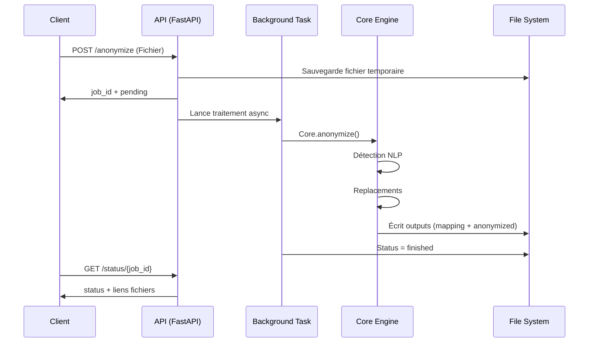

# 🏗️ Architecture Technique

**Anonyfiles** adopte une architecture modulaire afin de maximiser la réutilisation du code entre :

- la **CLI**
- l'**API REST**
- l'**Interface Graphique (GUI)**

---

## 🧩 Vue d'ensemble

Le projet est organisé en quatre composantes principales :

1. **`anonyfiles_core` (Cœur Métier)**  
   Bibliothèque Python contenant la logique NLP, les stratégies de remplacement et la gestion des fichiers.  
   → **Aucune dépendance UI**

2. **`anonyfiles_cli` (Interface Terminal)**  
   Expose les fonctionnalités du Core via une interface en ligne de commande.

3. **`anonyfiles_api` (Service REST)**  
   Serveur FastAPI exposant le Core via HTTP de manière **asynchrone**.

4. **`anonyfiles_gui` (Desktop)**  
   Application Tauri (Rust + Svelte) pilotant le CLI en Sidecar.

---

## 🧱 Diagramme de Dépendances

```mermaid
graph TD
    subgraph Python
        CORE[anonyfiles_core<br>(Moteur NLP & Logique)]
        CLI[anonyfiles_cli<br>(Interface CLI)]
        API[anonyfiles_api<br>(FastAPI REST)]
    end

    subgraph Desktop
        GUI[anonyfiles_gui<br>(Rust + Svelte)]
    end

    CLI -->|Importe| CORE
    API -->|Importe| CORE
    GUI -->|Exécute| CLI
```

---

## ⚙️ Détail des Composants

### 1. **Le Cœur (`anonyfiles_core`)**

Contient :

- Pipeline NLP (spaCy)
- Processus de lecture/écriture multi-formats (`.docx`, `.pdf`, `.xlsx`, `.txt`...)
- Stratégies d’anonymisation :
  - Faker
  - Codes séquentiels
  - Redact Masqué
  - Placeholder
- Mapping & logs d’audit

> C’est la couche **pure**, entièrement réutilisable sans interface.

---

### 2. **La CLI (`anonyfiles_cli`)**

Responsable de :

- Parsing des arguments (Typer/Click)
- Chargement & validation du `config.yaml`
- Affichage utilisateur (progress, tableaux)
- Jobs locaux en filesystem

Usage typique :

```bash
anonyfiles-cli anonymize rapport.docx
```

---

### 3. **L’API Asynchrone (`anonyfiles_api`)**

Optimisée pour le traitement de fichiers volumineux via un système de **Jobs** :

- Client → `POST /anonymize`
- Retour immédiat `{job_id}`
- Traitement en tâche de fond
- Polling (`GET /status`) ou WebSocket (`/ws/{job_id}`)

Avantages :

✔ pas de blocage du serveur HTTP  
✔ compatible workers / filesystems / clusters  

---

### 4. **La GUI (`anonyfiles_gui`)**

Construite avec :

- **Frontend** → Svelte
- **Backend** → Rust (Tauri)

Elle **n’intègre pas Python** mais pilote la CLI comme un **Sidecar** :

→ Permet d’éviter la distribution d’un runtime Python

---

## 🔄 Flux de Données (API)

Traitement complet d’une anonymisation via l’API :



---

## 📂 Structure du Projet

```plaintext
anonyfiles/
├── anonyfiles_core/       # Logique métier pure
│   ├── anonymizer/        # Stratégies + NLP
│   └── config/            # Gestion YAML + validation
├── anonyfiles_cli/        # Interface CLI
│   └── commands/          # Commandes anonymize / jobs
├── anonyfiles_api/        # Serveur FastAPI
│   └── routers/           # Endpoints REST
├── anonyfiles_gui/        # Desktop App Tauri
│   ├── src-tauri/         # Backend Rust
│   └── src/               # Frontend Svelte
└── deploy/                # Docker, Systemd, scripts
```

---

