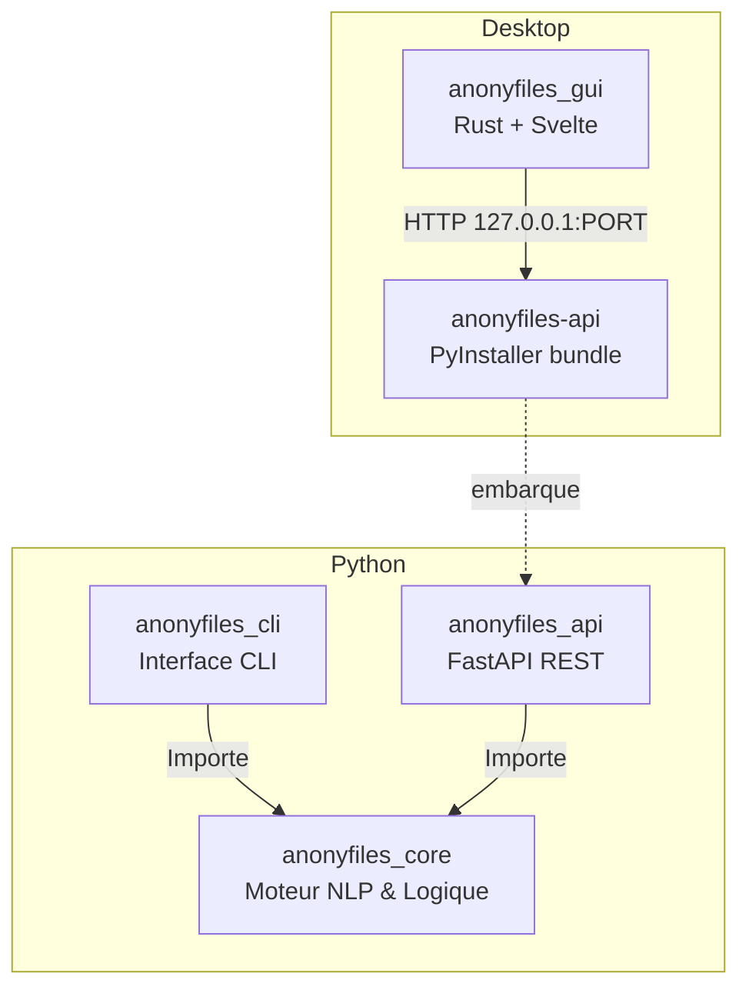
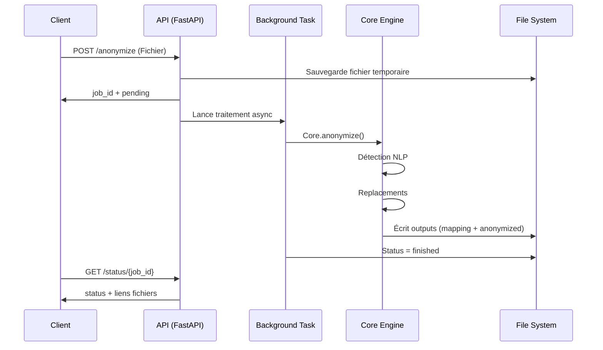

# 🏗️ Architecture Technique

**Anonyfiles** adopte une architecture modulaire afin de maximiser la réutilisation du code entre :

- la **CLI**
- l'**API REST**
- l'**Interface Graphique (GUI)**

---

## 🧩 Vue d'ensemble

Le projet est organisé en quatre composantes principales :

1. **`anonyfiles_core` (Cœur Métier)**  
   Bibliothèque Python contenant la logique NLP, les stratégies de remplacement et la gestion des fichiers.  
   → **Aucune dépendance UI**

2. **`anonyfiles_cli` (Interface Terminal)**  
   Expose les fonctionnalités du Core via une interface en ligne de commande.

3. **`anonyfiles_api` (Service REST)**  
   Serveur FastAPI exposant le Core via HTTP de manière **asynchrone**.

4. **`anonyfiles_gui` (Desktop)**  
   Application Tauri 2 (Rust + Svelte) qui embarque l'API FastAPI en **sidecar** (binaire PyInstaller). Le frontend parle HTTP à `127.0.0.1:<port-aléatoire>` exactement comme le fait le mode web — un seul contrat d'API pour les 3 modes de déploiement.

---

## 🧱 Diagramme de Dépendances


```mermaid
graph TD
    subgraph Python
        CORE[anonyfiles_core<br>Moteur NLP & Logique]
        CLI[anonyfiles_cli<br>Interface CLI]
        API[anonyfiles_api<br>FastAPI REST]
    end

    subgraph Desktop
        GUI[anonyfiles_gui<br>Rust + Svelte]
        SIDECAR[anonyfiles-api<br>PyInstaller bundle]
    end

    CLI -->|Importe| CORE
    API -->|Importe| CORE
    GUI -->|HTTP 127.0.0.1:PORT| SIDECAR
    SIDECAR -.->|embarque| API
```

---

## ⚙️ Détail des Composants

### 1. **Le Cœur (`anonyfiles_core`)**

Contient :

- Pipeline NLP (spaCy)
- Processus de lecture/écriture multi-formats (`.docx`, `.pdf`, `.xlsx`, `.txt`...)
- Stratégies d’anonymisation :
  - Faker
  - Codes séquentiels
  - Redact Masqué
  - Placeholder
- Mapping & logs d’audit

> C’est la couche **pure**, entièrement réutilisable sans interface.

---

### 2. **La CLI (`anonyfiles_cli`)**

Responsable de :

- Parsing des arguments (Typer/Click)
- Chargement & validation du `config.yaml`
- Affichage utilisateur (progress, tableaux)
- Jobs locaux en filesystem

Usage typique :

```bash
anonyfiles-cli anonymize rapport.docx
```

---

### 3. **L’API Asynchrone (`anonyfiles_api`)**

Optimisée pour le traitement de fichiers volumineux via un système de **Jobs** :

- Client → `POST /anonymize`
- Retour immédiat `{job_id}`
- Traitement en tâche de fond
- Polling (`GET /status`) ou WebSocket (`/ws/{job_id}`)

Avantages :

✔ pas de blocage du serveur HTTP  
✔ compatible workers / filesystems / clusters  

---

### 4. **La GUI (`anonyfiles_gui`)**

Construite avec :

- **Frontend** → Svelte + TypeScript
- **Shell natif** → Rust (Tauri 2)
- **Moteur NLP** → sidecar PyInstaller contenant FastAPI + uvicorn + spaCy + le modèle FR

Trois modes de déploiement partagent exactement le même code API :

| Mode | Comment l'API est lancée |
|---|---|
| Docker / PaaS | `uvicorn anonyfiles_api.api:app` (déjà en place dans Dockerfile, Procfile, nixpacks) |
| Web | même image Docker derrière un reverse-proxy nginx |
| Desktop autonome | binaire PyInstaller `anonyfiles-api-<triple>` spawné par Tauri au démarrage |

**Cinématique desktop** :

1. Au démarrage de la fenêtre, `main.rs` pioche un port TCP libre (`portpicker`)
2. Il spawne le sidecar avec `--port N --host 127.0.0.1` via `tauri-plugin-shell`
3. Le port est exposé au frontend par la commande Tauri `get_api_port`
4. `src/lib/utils/api.ts` résout `API_BASE = http://127.0.0.1:N` en mode desktop, `VITE_ANONYFILES_API_URL` en mode web
5. Pendant le cold-start (~15-25 s, chargement du modèle spaCy), un overlay bloque l'UI et `App.svelte` poll `/api/health` jusqu'à 200 OK
6. À la fermeture, `tauri-plugin-shell` tue le sidecar proprement

Le bundle final contient le binaire sidecar (~120 Mo), le modèle spaCy embarqué, et la webview système. Aucune dépendance Python / Rust requise sur la machine cible.

---

## 🔄 Flux de Données (API)

Traitement complet d’une anonymisation via l’API :


```mermaid
sequenceDiagram
    participant Client
    participant API as API (FastAPI)
    participant Worker as Background Task
    participant Core as Core Engine
    participant FS as File System

    Client->>API: POST /anonymize (Fichier)
    API->>FS: Sauvegarde fichier temporaire
    API->>Client: job_id + pending
    
    API->>Worker: Lance traitement async
    Worker->>Core: Core.anonymize()
    Core->>Core: Détection NLP
    Core->>Core: Replacements
    Core->>FS: Écrit outputs (mapping + anonymized)
    
    Worker->>FS: Status = finished
    
    Client->>API: GET /status/{job_id}
    API->>Client: status + liens fichiers
```

---

## 📂 Structure du Projet

```plaintext
anonyfiles/
├── anonyfiles_core/       # Logique métier pure
│   ├── anonymizer/        # Stratégies + NLP
│   └── config/            # Gestion YAML + validation
├── anonyfiles_cli/        # Interface CLI
│   └── commands/          # Commandes anonymize / jobs
├── anonyfiles_api/        # Serveur FastAPI
│   └── routers/           # Endpoints REST
├── anonyfiles_gui/        # Desktop App Tauri
│   ├── src-tauri/         # Backend Rust
│   └── src/               # Frontend Svelte
└── deploy/                # Docker, Systemd, scripts
```

---

