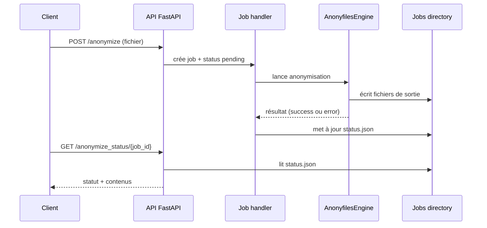
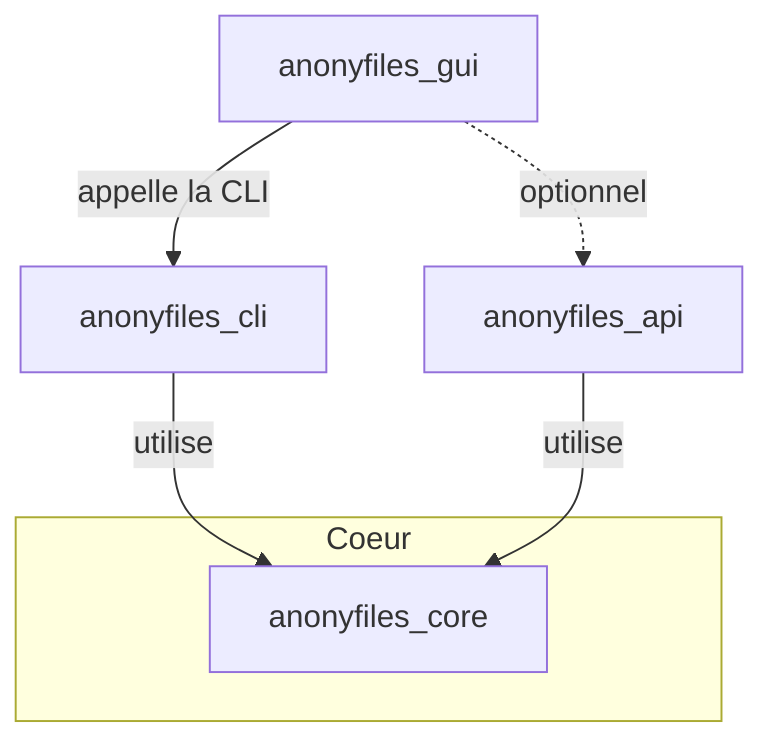

# Architecture et flux de requête

Ce document décrit le chemin complet d'une requête depuis le client jusqu'au stockage des résultats ainsi que les relations entre la CLI, l'API et la GUI.

## Modules principaux

- **anonyfiles_core** : moteur d'anonymisation commun.
- **anonyfiles_cli** : outil en ligne de commande utilisant `anonyfiles_core`.
- **anonyfiles_api** : API FastAPI qui réutilise également `anonyfiles_core`.
- **anonyfiles_gui** : interface graphique Tauri qui s'appuie sur la CLI.

Extrait du `README.md` montrant cette organisation :

```text
* `anonyfiles_cli` : outil en ligne de commande s’appuyant sur `anonyfiles_core` pour traiter les fichiers localement.
* `anonyfiles_api` : API REST (FastAPI) qui utilise également `anonyfiles_core` afin d’exposer les mêmes fonctionnalités à distance.
La GUI Tauri, située dans `anonyfiles_gui`, s’appuie elle-même sur l’API pour offrir une interface graphique.
```

## Flux complet d'une requête d'anonymisation

1. **Client** : envoie une requête `POST /anonymize` avec le fichier et les options.
2. **API FastAPI** : sauvegarde le fichier dans un dossier de job (`jobs/<job_id>`), écrit `status.json` et lance `run_anonymization_job_sync` en tâche de fond.
3. **Moteur `AnonyfilesEngine`** : lit le fichier, applique les règles d'anonymisation, écrit les fichiers de sortie (texte anonymisé, mapping CSV, log CSV, audit).
4. **Job utils** : met à jour `status.json` à `finished` ou `error` et stocke le journal d'audit.
5. **Client** : récupère le statut via `GET /anonymize_status/{job_id}` ou la WebSocket `/ws/{job_id}` puis télécharge éventuellement les fichiers avec `GET /files/{job_id}/{file_key}`.

Les fichiers générés sont stockés dans le dossier `jobs/` (aucune base de données n'est utilisée par défaut).



## Relations CLI, API et GUI



La CLI et l’API partagent le même moteur (`anonyfiles_core`). La GUI interagit principalement avec la CLI pour réaliser l’anonymisation localement mais peut aussi appeler l’API si un serveur distant est disponible.
