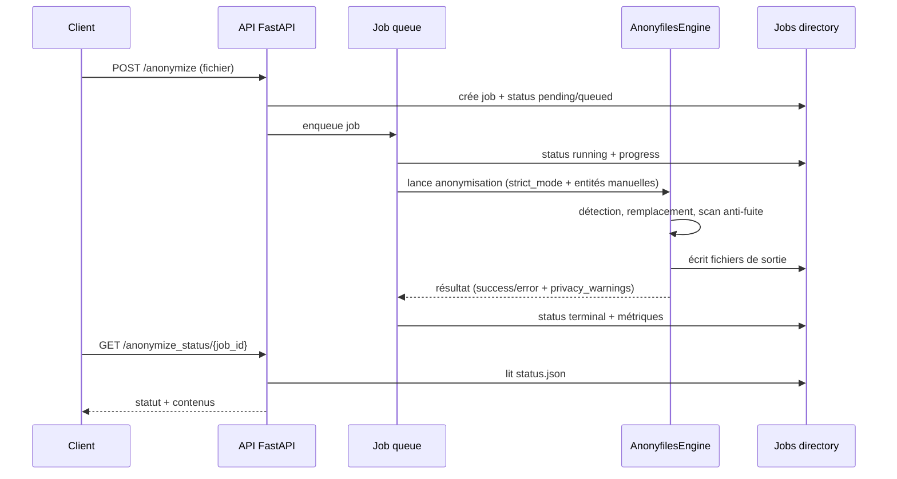
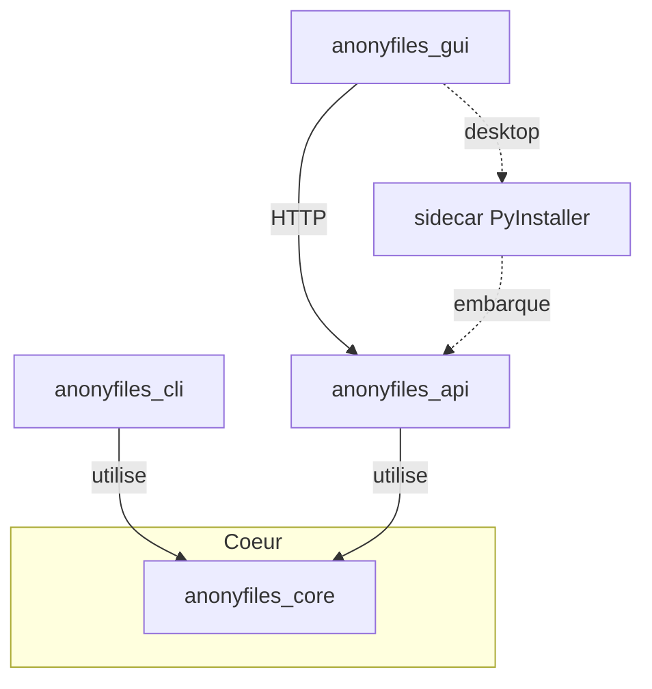

# Architecture et flux de requête

Ce document décrit le chemin complet d'une requête depuis le client jusqu'au stockage des résultats ainsi que les relations entre la CLI, l'API et la GUI.

## Modules principaux

- **anonyfiles_core** : moteur d'anonymisation commun.
- **anonyfiles_cli** : outil en ligne de commande utilisant `anonyfiles_core`.
- **anonyfiles_api** : API FastAPI qui réutilise également `anonyfiles_core`.
- **anonyfiles_gui** : interface graphique Tauri qui parle HTTP à l'API.

Extrait du `README.md` montrant cette organisation :

```text
* `anonyfiles_cli` : outil en ligne de commande s’appuyant sur `anonyfiles_core` pour traiter les fichiers localement.
* `anonyfiles_api` : API REST (FastAPI) qui utilise également `anonyfiles_core` afin d’exposer les mêmes fonctionnalités à distance.
La GUI Tauri, située dans `anonyfiles_gui`, s’appuie elle-même sur l’API pour offrir une interface graphique.
```

## Flux complet d'une requête d'anonymisation

1. **Client** : envoie une requête `POST /anonymize` avec le fichier et les options. `config_options` peut activer `strictMode`, et `entity_decisions` peut porter des entités ajoutées manuellement (`"source": "manual"`).
2. **API FastAPI** : sauvegarde le fichier dans un dossier de job (`jobs/<job_id>`), écrit `status.json` et ajoute le travail à la file de jobs interne.
3. **Job queue** : exécute le moteur dans un worker, applique retry/timeout, gère les annulations et met à jour `state`, `progress`, `attempt` et les métriques d'exploitation.
4. **Moteur `AnonyfilesEngine`** : lit le fichier, détecte les entités (spaCy + regex, heuristiques supplémentaires si `strict_mode`), injecte les entités manuelles, applique les règles d'anonymisation, puis re-scanne la sortie finale pour repérer les valeurs sensibles résiduelles. Il écrit les fichiers de sortie (texte anonymisé, mapping CSV, log CSV, audit) et renvoie `privacy_warnings` / `privacy_warnings_count`.
5. **Job utils** : met à jour `status.json` à `finished`, `error`, `cancelled` ou `timeout`, stocke le journal d'audit (avec `privacy_warnings`) et publie les logs `job_event`.
6. **Client** : récupère le statut via `GET /anonymize_status/{job_id}` ou la WebSocket `/ws/{job_id}` puis télécharge éventuellement les fichiers avec `GET /files/{job_id}/{file_key}`. Les `privacy_warnings` éventuels sont affichés sans bloquer le téléchargement.

Les fichiers générés sont stockés dans le dossier `jobs/` (aucune base de données n'est utilisée par défaut).


```mermaid
sequenceDiagram
    participant C as Client
    participant A as API FastAPI
    participant J as Job queue
    participant E as AnonyfilesEngine
    participant F as Jobs directory

    C->>A: POST /anonymize (fichier)
    A->>F: crée job + status pending/queued
    A->>J: enqueue job
    J->>F: status running + progress
    J->>E: lance anonymisation (strict_mode + entités manuelles)
    E->>E: détection, remplacement, scan anti-fuite
    E->>F: écrit fichiers de sortie
    E-->>J: résultat (success/error + privacy_warnings)
    J->>F: status terminal + métriques
    C->>A: GET /anonymize_status/{job_id}
    A->>F: lit status.json
    A-->>C: statut + contenus
```

## Relations CLI, API et GUI


```mermaid
graph TD
    subgraph Coeur
        CORE["anonyfiles_core"]
    end

    CLI["anonyfiles_cli"] -->|utilise| CORE
    API["anonyfiles_api"] -->|utilise| CORE
    GUI["anonyfiles_gui"] -->|HTTP| API
    SIDECAR["sidecar PyInstaller"] -.->|embarque| API
    GUI -. desktop .-> SIDECAR
```

La CLI et l’API partagent le même moteur (`anonyfiles_core`). La GUI parle HTTP à l'API : en desktop autonome elle spawne le sidecar PyInstaller, en mode web elle pointe vers l'API servie côté serveur.
